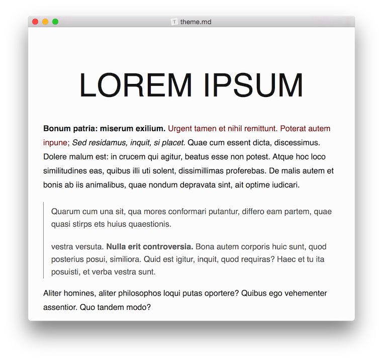
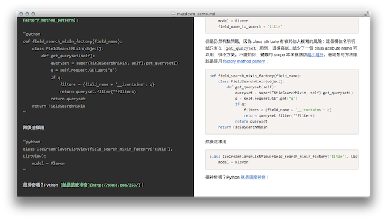
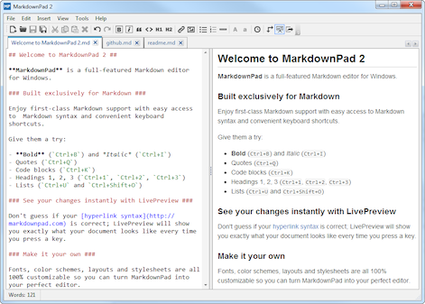

# Markdown快速入门
## 什么是Markdown
简单来说，Markdown就是一种**纯文本排版标记语法**。

比如说，在Word等各种编辑器中，要对字体进行改变，你需要“选择字体”，然后设置字体的属性。

而使用Markdown，一些都是纯文本，不同的字体属性通过标点符号来区分。


比如：

> \*\*字符文字\*\* ：**粗体字**

> \*字符文字\* ：*斜体字*

> \#大标题 ：# 大标题

> \##大标题 ：## 大标题

> \###大标题 ：### 大标题

> \- 列表1

等等...


千万别觉得Markdown是一种很程序员的东西，超多的编辑器，都支持Markdown语法，像：石墨文档、为知笔记、简书、CSDN等等等...

标记语法的好处是，标准化。写的markdown文档，可以转化成网站，可以转化成PDF，可以转化成Word......

比如，有一种标记语法LaTeX，是直接可以用来印刷出书的。


网上介绍很多，引出其中一篇：

[Markdown基本语法（https://www.jianshu.com/p/191d1e21f7ed）](https://www.jianshu.com/p/191d1e21f7ed)

## Markdown工具

Markdown是一个语法，书写和保存方便。

但缺点就是不能所见即所得。

有没有办法，在书写的时候就能预览到效果？

这就需要编辑器工具了。

### Typora

[https://typora.io/](https://typora.io/)

Mac、Windows、Linux全平台可用。

比较简单够用，目前免费。




### Macdown

[https://macdown.uranusjr.com/](https://macdown.uranusjr.com/
)


标准左右看板，开源免费。Mac专用。

### Visual Studio Code

[https://code.visualstudio.com/](https://code.visualstudio.com/)

基本工程师们都安装了的。

编辑.md文件的时候，快捷键⌘ + K, V，就可以打开Markdown预览。


### 其它

还有没有其它？

像MarkdownPad，Windows专用；
像Mou、Ulysses等等Mac专用；



很多，自己去搜索引擎搜吧，毕竟都成年了。


## 附件的摆放和显示

### 图片
大部分情况，将原型图、流程图转化成「图片」是最好的。

一般放到**docs/images/**目录下方，并在Markdown里引用。

```

```


### Axure HTML文档

如果导出Axure的是HTML，HTML可以整个挪动到**docs/axure/**目录下。

Markdown中想要引用HTML原型图，你可以：


1. iFrame嵌入

```
<iframe src="./axure/index.html" />
```

2. 链接跳转

```
[某功能的原型图查看](./axure/function.html)
```

3. 变成图片

```

```